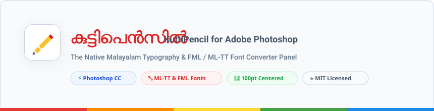
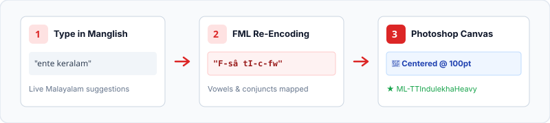
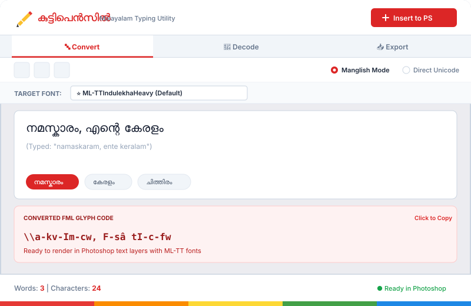

<div align="center">



<br/>

[](#-system-requirements)
[](#-system-requirements)
[](#-installation)
[](LICENSE)
[](https://kuttipencil.in)

<br/>

<p align="center">
  <strong>The Essential Malayalam Typography &amp; FML/ML-TT Font Converter Extension for Adobe Photoshop.</strong><br/>
  <em>Type in Manglish or Malayalam Unicode directly inside Photoshop and render legacy ML/FML fonts with one click.</em>
</p>

</div>

---

## 📖 Overview

Standard Malayalam Unicode text (e.g. `മലയാളം`) cannot be rendered correctly when using classic Malayalam desktop publishing fonts (**ML-TT**, **FML**, **Scribe-ML**, **Indulekha**, **Thunchan**, **Vishu**, etc.) in Adobe Photoshop.

**KuttiPencil for Photoshop** is a native Adobe CEP Panel Extension inspired by [kuttipencil.in](https://kuttipencil.in). It bridges the gap between modern phonetic typing and legacy Malayalam typography, enabling designers to type in **Manglish** and generate **100pt centered text layers** styled with their preferred **ML-TT font** instantly!

<br/>

<div align="center">
  
</div>

---

## 🖥️ Extension UI Preview

<div align="center">
  
</div>

---

## ✨ Key Features

| Feature | Description |
| :--- | :--- |
| 🔤 **Manglish Transliteration** | Real-time phonetic Malayalam typing with interactive suggestion chips (`namaskaram` $\rightarrow$ `നമസ്കാരം`). |
| ⚡ **Direct Unicode Mode** | Paste standard Malayalam Unicode text for instant ASCII glyph conversion. |
| 🎯 **1-Click Centered Layer** | Spawns a text layer positioned at `[width/2, height/2]` at **100pt size** with **`ML-TTIndulekhaHeavy`** applied. |
| 🔄 **Layer Synchronizer** | Select any existing text layer on canvas and update its contents in-place. |
| 🔍 **Reverse Decode Mode** | Paste legacy FML/ML-TT text or read directly from a Photoshop layer to decode back to readable Unicode. |
| 📥 **Downloads Folder Export** | 1-Click transparent PNG and high-quality JPG export directly into your system `Downloads` folder. |
| 📊 **Real-time Statistics** | Live `Words: X` and `Characters: Y` counters matching the official Kuttipencil web utility. |

---

## 🗂️ 3-Tab Architecture

```
┌──────────────────────────┬──────────────────────────┬──────────────────────────┐
│       01. CONVERT        │        02. DECODE        │        03. EXPORT        │
├──────────────────────────┼──────────────────────────┼──────────────────────────┤
│ • Manglish Transliterate │ • FML to Unicode Decode  │ • Quick PNG to Downloads │
│ • Direct Unicode Paste   │ • Read active PS Layer   │ • Quick JPG to Downloads │
│ • Target Font Selection  │ • Copy Decoded Unicode   │ • Zero Compression Loss  │
│ • Insert 100pt to PS     │                          │                          │
└──────────────────────────┴──────────────────────────┴──────────────────────────┘
```

---

## 🎨 Supported Font Library

KuttiPencil-PS automatically connects with your system's installed Malayalam fonts:

| Category | Supported Font Families |
| :--- | :--- |
| **⭐ Preferred Default** | `ML-TTIndulekhaHeavy` (BoldItalic, Regular) |
| **ML-TT Series** | `ML-TTThunchan`, `ML-TTVishu`, `ML-TTVisakham`, `ML-TTVinay`, `ML-TTAswathi`, `ML-TTNila`, `ML-TTChandrika`, `ML-TTBhavana`, `ML-TTGopika`, `ML-TTGuruvayur`, `ML-TTKaumudi`, `ML-TTNandini`, `ML-TTOnam`, `ML-TTRohini`, `ML-TTRavivarma`, `ML-TTSankara`, `ML-TTThiruvathira`, `ML-TTJyothy`, `ML-TTChithiraHeavy`, `ML-TTAshtamudiExBold` |
| **ML1-TT Series** | `ML1-TTIndulekha`, `ML1-TTAswathi`, `ML1-TTAmbili` |
| **FML Series** | `FML-Indulekha`, `FML-Akhila`, `FML-Thunchan`, `FML-Karthika`, `FML-Revathi` |
| **Publishing Series** | `Scribe-ML-Badusha`, `ML-KV-Anamika`, `ML-KV-Ananya`, `M_Kairali`, `Indu No_1`, `Aruna`, `Indira`, `Manorama`, `Mathrubhumi` |

> [!NOTE]
> Modern Unicode fonts (*Noto Sans Malayalam, Manjari, Gayathri*) are excluded from conversion as they use Unicode encoding rather than legacy ASCII glyph maps.

---

## 🚀 Installation Guide

### Option 1: Automated 1-Click Install (Windows)

1. **Clone or Download** the repository:
   ```bash
   git clone https://github.com/AbinVarghexe/kuttipencil-photoshop.git
   ```
2. Double-click **`enable-debug-mode.bat`** (enables CEP developer extension loading).
3. Double-click **`install-extension.bat`** (installs extension into your Photoshop CEP folder).
4. Restart **Adobe Photoshop**.
5. Open via: **`Window`** $\rightarrow$ **`Extensions (legacy)`** $\rightarrow$ **`Kutti Pencil`**.

---

### Option 2: Manual Installation

<details>
<summary><strong>Windows Manual Setup</strong> (Click to Expand)</summary>

1. Press <kbd>Win</kbd> + <kbd>R</kbd>, type `regedit`, and hit <kbd>Enter</kbd>.
2. Navigate to `HKEY_CURRENT_USER\Software\Adobe\CSXS.9` (create key if missing).
3. Add a new **String Value (`REG_SZ`)** named `PlayerDebugMode` with value `1`. Repeat for `CSXS.10` through `CSXS.14`.
4. Copy the entire `kuttipencil` directory to:
   ```
   C:\Users\<YourUsername>\AppData\Roaming\Adobe\CEP\extensions\kuttipencil
   ```
5. Restart Photoshop and open **Window > Extensions (legacy) > Kutti Pencil**.

</details>

<details>
<summary><strong>macOS Manual Setup</strong> (Click to Expand)</summary>

1. Open **Terminal** and enable `PlayerDebugMode`:
   ```bash
   defaults write com.adobe.CSXS.9 PlayerDebugMode 1
   defaults write com.adobe.CSXS.10 PlayerDebugMode 1
   defaults write com.adobe.CSXS.11 PlayerDebugMode 1
   defaults write com.adobe.CSXS.12 PlayerDebugMode 1
   defaults write com.adobe.CSXS.13 PlayerDebugMode 1
   defaults write com.adobe.CSXS.14 PlayerDebugMode 1
   ```
2. Copy the `kuttipencil` folder into:
   ```bash
   ~/Library/Application Support/Adobe/CEP/extensions/kuttipencil
   ```
3. Restart Photoshop and open **Window > Extensions (legacy) > Kutti Pencil**.

</details>

---

## 📁 Repository Structure

```
kuttipencil/
├── assets/
│   ├── banner.svg            # Official brand header banner
│   ├── ui-preview.svg        # Vector extension UI mockup
│   └── workflow.svg          # 3-step conversion pipeline diagram
├── CSXS/
│   └── manifest.xml          # Extension metadata & Photoshop CSXS target bundle
├── css/
│   └── style.css             # Authentic Kuttipencil web design stylesheet
├── js/
│   ├── converter.js          # Malayalam <-> FML engine + transliterator
│   ├── libs/
│   │   └── CSInterface.js    # Official Adobe CEP Host Bridge
│   └── main.js               # UI controller, 3-tab router, live counters
├── jsx/
│   └── hostscript.jsx        # Photoshop ExtendScript engine (ActionManager & font resolver)
├── .debug                    # Remote Chrome DevTools debug port (8088)
├── .gitignore                # Git ignore rules
├── LICENSE                   # MIT License
├── enable-debug-mode.bat     # Windows debug mode registry script
├── install-extension.bat    # Windows CEP extension deploy script
├── index.html                # 3-Tab Kuttipencil Panel UI
└── README.md                 # Complete documentation & usage guide
```

---

## ⚖️ Disclaimer & Attribution

- **Inspiration**: This project is an independent, open-source community extension inspired by [kuttipencil.in](https://kuttipencil.in), created by **LEO Softwares / Sindhu PV** (Kozhikode, Kerala).
- **Trademarks**: "കുട്ടിപെൻസിൽ" and "Kuttipencil" are properties of their respective owners. This extension is not officially affiliated with LEO Softwares, but was built with profound respect for their contribution to Malayalam digital computing.

---

## 📄 License

This project is licensed under the **[MIT License](LICENSE)**.

<div align="center">
  <sub>Built with ❤️ for Malayalam Graphic Designers &amp; Typographers.</sub>
</div>
